# Building a Network Lab: Understanding TCP/UDP Through Controlled Chaos

<div align="center">


**"Networking clicked for me when I started breaking it on purpose."**

</div>

---

## 📖 Introduction
This guide documents a practical learning journey into computer networking fundamentals. The learner, already comfortable with Linux installations and basic Python, sought to deepen their understanding of operating systems, databases, and computer networks before starting their first job. 

Following advice from a Reddit community, they embarked on an enlightening project: **building a multi-VM network topology and intentionally breaking it** to observe how different protocols respond to network impairments.

### The Learning Objective
Rather than memorizing textbook diagrams, this hands-on approach aims to answer fundamental questions:
* How do packets actually travel between machines that can't talk directly?
* What happens when networks become unreliable (latency, packet loss)?
* Why do TCP and UDP behave so differently under poor network conditions?
* How does a router actually forward traffic?

---

## 🗺️ Project Overview


### Key Components
* **Three Virtual Machines:** Client, Router, and Server.
* **Two Isolated Networks:** Simulating separate network segments.
* **Manual Routing:** Learning how packets find their destination.
* **Network Impairments:** Artificial latency and packet loss.
* **Protocol Comparison:** TCP vs UDP behavior under stress.

---

## 🏗️ Phase 1: The Setup (Creating the Sandbox)

### Why Virtual Machines on Windows?
The learner initially wondered whether to boot Linux from disk or use their existing Windows installation. The answer: **stay on Windows and use virtualization.**
* **Need all three machines running simultaneously.**
* Type 2 hypervisors (VirtualBox, VMware) run as normal Windows applications.

### Network Architecture Design


### VirtualBox Network Configuration

| VM | Adapter | Network Type | Network Name |
| :--- | :--- | :--- | :--- |
| **VM A** | Adapter 1 | Internal Network | "LanA" |
| **VM B** | Adapter 1 | Internal Network | "LanA" |
| **VM B** | Adapter 2 | Internal Network | "LanC" |
| **VM C** | Adapter 1 | Internal Network | "LanC" |

> **Note:** An optional NAT adapter on VM B can be temporarily enabled for package installation, then disabled afterward.

---

## 🛣️ Phase 2: Manual Routing (Understanding Packet Flow)

### 1. IP Address Assignment
Configure network interfaces with static IP addresses:

```bash
# On VM A (Client)
sudo ip addr add 192.168.10.2/24 dev eth0

# On VM C (Server)
sudo ip addr add 192.168.20.2/24 dev eth0

# On VM B (Router)
sudo ip addr add 192.168.10.1/24 dev eth0  # Facing LAN A
sudo ip addr add 192.168.20.1/24 dev eth1  # Facing LAN C
```

### 2. The Routing Problem
VM A only knows about the `192.168.10.0/24` network. It has no knowledge of how to reach `192.168.20.0/24`.


### 3. The Solution: Routing Tables
Tell machines where to send packets destined for networks they're not directly connected to:

```bash
# On VM A: Tell it to use VM B as gateway for the 192.168.20.0/24 network
sudo ip route add 192.168.20.0/24 via 192.168.10.1

# On VM C: Tell it to use VM B as gateway for the 192.168.10.0/24 network
sudo ip route add 192.168.10.0/24 via 192.168.20.1
```

### 4. Enabling IP Forwarding (The "Secret Sauce")
Even with routing tables, Linux drops packets not addressed to itself by default (Security Policy).

**The Critical Command:**
```bash
# On VM B (Router)
sudo sysctl -w net.ipv4.ip_forward=1
```

**Analogy: The Hotel Receptionist**
* **Forwarding OFF:** "Sorry, policy says I can't deliver items to guests." (Packet dropped)
* **Forwarding ON:** "Sure, I'll run this up to Room 202 for you." (Packet forwarded)

```mermaid
sequenceDiagram
    participant A as VM A<br/>(192.168.10.2)
    participant B as VM B<br/>(ip_forward=1)
    participant C as VM C<br/>(192.168.20.2)
    
    A->>B: Packet for 192.168.20.2
    Note over B: Check routing table<br/>Destination is on eth1
    B->>C: Forward packet
    C->>B: Reply packet
    B->>A: Forward reply
    Note over A: ✅ Communication established!
```



---

## ⚡ Phase 3: Controlled Chaos (Breaking the Network)

### Establishing a Baseline
Before breaking anything, we confirm Gbps speeds and 0 retransmissions using `iperf3`.

### Experiment A: Adding Latency
Simulating satellite or intercontinental links.
```bash
# On VM B (Router)
sudo tc qdisc add dev eth0 root netem delay 200ms
```


### Experiment B: Packet Loss
Simulating faulty hardware or congestion.
```bash
# On VM B (Router)
sudo tc qdisc change dev eth0 root netem delay 200ms loss 10%
```


---

## ⚔️ Phase 4: TCP vs UDP Battle Royale

With **200ms latency** and **10% packet loss**, how do protocols cope?


### TCP: The Perfectionist
TCP guarantees delivery. When packets are lost, it assumes congestion and slows down.


### UDP: The Honey Badger
UDP fires and forgets. It doesn't care about reliability, only speed.


### Performance Comparison

| Metric | TCP | UDP |
| :--- | :--- | :--- |
| **Target Rate** | Dynamic | 100 Mbps |
| **Achieved Rate** | **~10 Mbps** (Throttled) | **~75 Mbps** (Consistent) |
| **Reliability** | 100% (Eventually) | ~75% |
| **Retransmissions** | High | None |
| **Behavior** | Adapts to conditions | Maintains speed |
| **Best For** | File transfers, Web pages | Streaming, VoIP, Gaming |

---

## 🔍 Phase 5: Visualization with Wireshark

Using `tcpdump` on the headless VMs and analyzing the `.pcap` files on the host machine.


**Key Insights:**
* **Black lines:** TCP retransmissions.
* **Red lines:** Duplicate ACKs and errors.
* **Pattern density:** Shows how hard TCP is working to fix the broken network.

---

## 🧠 Conceptual Summary


## What We Would Be Doing Next
**Implement a Firewall:** Use `iptables` to block specific traffic.
---

<div align="center">
  <i>"The best way to understand networking is to build something, break it, and watch what happens."</i>
</div>
