```mermaid
sequenceDiagram
    participant A as Client
    participant B as Router
    participant C as Server
    
    A->>B: Packet 1
    B->>C: Packet 1 ✓
    A->>B: Packet 2
    B-xC: Packet 2 ✗ (Lost!)
    A->>B: Packet 3
    B->>C: Packet 3 ✓
    A->>B: Packet 4
    B->>C: Packet 4 ✓
    Note over A: No acknowledgments<br/>No retransmissions<br/>Constant speed
```

# Understanding TCP/UDP Through VM implementations
>Date: 2026-01-29
<div align="center">


**"... or have a cup of coffee?"**

</div>

---

## 📖 Project Overview

I built a multi-VM network topology to understand how packets travel between machines and how different protocols respond to network impairments. In order to achieve this, I manually configured the routing, then deliberately broke the network to observe TCP vs UDP behavior.


### Key Components
* **Three Virtual Machines:** Client, Router, and Server
* **Two Isolated Networks:** Simulating separate network segments
* **Manual Routing:** Understanding packet forwarding
* **Network Impairments:** Artificial latency and packet loss
* **Protocol Comparison:** TCP vs UDP under stress

---

## 🏗️ Phase 1: Network Setup

### Why VirtualBox on Windows?

I needed all three machines running simultaneously. VirtualBox's "Internal Network" feature lets me create isolated network segments that can only communicate through my router VM.

### Network Architecture


### VirtualBox Configuration

| VM | Adapter | Network Type | Network Name |
| :--- | :--- | :--- | :--- |
| **VM A** | Adapter 1 | Internal Network | "LanA" |
| **VM B** | Adapter 1 | Internal Network | "LanA" |
| **VM B** | Adapter 2 | Internal Network | "LanC" |
| **VM C** | Adapter 1 | Internal Network | "LanC" |

---

## 🛣️ Phase 2: Manual Routing Configuration

### Step 1: IP Address Assignment

```bash
# VM A (Client)
sudo ip addr add 192.168.10.2/24 dev eth0

# VM C (Server)
sudo ip addr add 192.168.20.2/24 dev eth0

# VM B (Router)
sudo ip addr add 192.168.10.1/24 dev eth0  # Facing LAN A
sudo ip addr add 192.168.20.1/24 dev eth1  # Facing LAN C
```

### Step 2: The Routing Problem

At this point, VM A can't reach VM C. VM A only knows about the `192.168.10.0/24` network.


### Step 3: Adding Routing Tables

I needed to tell each machine how to reach the other network through the router.

```bash
# VM A: Route to 192.168.20.0/24 via router
sudo ip route add 192.168.20.0/24 via 192.168.10.1

# VM C: Route to 192.168.10.0/24 via router
sudo ip route add 192.168.10.0/24 via 192.168.20.1
```

**What this means:**
- VM A: "To reach 192.168.20.x, send packets to 192.168.10.1"
- VM C: "To reach 192.168.10.x, send packets to 192.168.20.1"

### Step 4: The 100% Packet Loss Mystery

Even with routing tables configured, pinging VM C from VM A showed 100% packet loss. However, I could successfully ping `192.168.20.1` (the router's IP).

**The Issue:** I was confusing talking *to* the router vs talking *through* the router.

- **Pinging .1 (192.168.20.1):** Direct communication with the router ✓
- **Pinging .2 (192.168.20.2):** Requires the router to forward packets ✗

I asked Gemini about this, and it explained that Linux drops packets not destined for itself by default. The router received packets for `.2` but refused to forward them.

### Step 5: Enabling IP Forwarding

```bash
# VM B (Router) - The critical command
sudo sysctl -w net.ipv4.ip_forward=1
```

**What this does:**
- **Default (0):** Router drops packets addressed to other machines (security policy)
- **Enabled (1):** Router forwards packets between interfaces

After enabling IP forwarding, everything worked perfectly!


### Key Insight: IP Address Ownership

I had another question: Why does `.1` behave differently from `.2`?

**Answer:** It's about who owns the IP address.
- **192.168.20.1** belongs to the router → Direct communication
- **192.168.20.2** belongs to VM C → Requires forwarding

The `.1` convention for routers is just human habit. Any IP would work if routing tables are updated accordingly.

---

## ⚡ Phase 3: Network Impairments

### Baseline Measurement

First, I established normal performance using `iperf3`:

```bash
# VM C (Server)
iperf3 -s

# VM A (Client)
iperf3 -c 192.168.20.2
```

**Results:** Gbps-level speeds, 0 retransmissions, sub-millisecond latency.

### Experiment A: Adding Latency

Using Traffic Control (`tc`) with Network Emulator (`netem`):

```bash
# VM B (Router)
sudo tc qdisc add dev eth0 root netem delay 200ms
```


**Effect:** Ping latency increased from <1ms to ~200ms (simulates satellite/intercontinental links).

### Experiment B: Packet Loss

```bash
# VM B (Router)
sudo tc qdisc change dev eth0 root netem delay 200ms loss 10%
```


**Effect:** Ping showed sequence numbers jumping (seq=1, seq=2, seq=4...). Missing packets were dropped by the router.

---

## ⚔️ Phase 4: TCP vs UDP Under Stress

Testing both protocols with **200ms latency** and **10% packet loss**.


### TCP: Reliability at All Costs

```bash
iperf3 -c 192.168.20.2
```


**Behavior:**
- Speed dropped to ~10 Mbps (from Gbps baseline)
- High retransmission count in `Retr` column
- TCP interprets loss as congestion → drastically reduces speed

**Why TCP struggles:**
1. Detects missing acknowledgments
2. Assumes network congestion
3. Reduces transmission window size
4. Retransmits missing packets
5. Takes time to ramp speed back up

### UDP: Speed Over Reliability

```bash
iperf3 -c 192.168.20.2 -u -b 100M
```



**Behavior:**
- Sent at 100 Mbps, received at ~75 Mbps
- No retransmissions
- Maintains consistent speed regardless of loss

**Why UDP maintains speed:**
- No acknowledgment mechanism
- No congestion control
- Continues transmitting at requested rate
- Application handles missing data

### The Missing "Loss" Counter

I was initially confused because I didn't see "packet loss" displayed. Gemini clarified:

**For TCP:** TCP doesn't report "loss" - it reports "Retr" (retransmissions). Check the `Retr` column on the sender.

**For UDP:** The sender doesn't know about loss (fire-and-forget). Check the receiver's (VM C) terminal for `Lost/Total` datagrams.

### Performance Summary

| Metric | TCP | UDP |
| :--- | :--- | :--- |
| **Target Rate** | Dynamic | 100 Mbps |
| **Achieved Rate** | ~10 Mbps | ~75 Mbps |
| **Reliability** | 100% (eventually) | ~75% |
| **Retransmissions** | High | None |
| **Behavior** | Adapts to conditions | Maintains speed |

---

## 🔍 Phase 5: Packet Capture with Wireshark

### Capturing Traffic

```bash
# VM A
sudo tcpdump -i eth0 -w capture_tcp.pcap
# Run iperf3 test
# Ctrl+C to stop
```

### Wireshark Analysis


**What I observed:**
- **Black lines:** TCP retransmissions
- **Red lines:** Duplicate ACKs and errors
- Visual density shows exactly how hard TCP works to recover from network issues

---

## 🧠 Technical Concepts Learned


### Core Concepts

1. **Routing Tables = Forwarding Instructions**
   - Not magic, just lookup tables
   - Format: `Destination → Gateway → Interface`

2. **IP Forwarding = Router Permission**
   - Default: Linux drops non-local packets (security)
   - Enabled: Linux acts as a router

3. **TCP vs UDP Philosophy**
   - **TCP:** Guarantee delivery, adapt to conditions
   - **UDP:** Maximize speed, ignore failures

4. **Network Stress Reveals Protocol Nature**
   - Perfect networks: Similar performance
   - Impaired networks: Dramatic behavioral differences

### Use Cases

**Use TCP for:**
- File transfers
- Web browsing
- Email
- Database connections
- Any scenario requiring data integrity

**Use UDP for:**
- Video streaming
- VoIP
- Online gaming
- DNS queries
- Any scenario where latency matters more than completeness

---

## 🛠️ Tools Reference

| Tool | Purpose | Key Commands |
|---|---|---|
| `ip` | Network configuration | `ip addr add`, `ip route add`, `ip route show` |
| `sysctl` | Kernel parameters | `sysctl -w net.ipv4.ip_forward=1` |
| `tc` | Traffic control | `tc qdisc add dev eth0 root netem delay 200ms loss 10%` |
| `iperf3` | Performance testing | `iperf3 -s`, `iperf3 -c <IP>`, `iperf3 -u -b <rate>` |
| `tcpdump` | Packet capture | `tcpdump -i eth0 -w file.pcap` |
| `ping` | Connectivity test | `ping <IP>` |

### Cleanup Commands

```bash
# Remove traffic control rules
sudo tc qdisc del dev eth0 root

# Verify removal
tc qdisc show dev eth0
```

---

## 🔧 Troubleshooting Notes

### Issue: 100% Packet Loss to Remote Network

**Symptoms:** Can ping router IP (.1) but not destination IP (.2)

**Diagnosis:** IP forwarding disabled

**Solution:**
```bash
# Check current setting
sysctl net.ipv4.ip_forward

# Enable forwarding
sudo sysctl -w net.ipv4.ip_forward=1
```

### Issue: No Connectivity at All

**Checklist:**
1. Verify IP addresses: `ip addr show`
2. Check routing tables: `ip route show`
3. Verify VirtualBox network assignments
4. Confirm IP forwarding: `sysctl net.ipv4.ip_forward`

### Issue: Traffic Control Rules Not Working

**Problem:** Rules applied to wrong interface

**Solution:** Apply rules to the interface traffic passes through (check with `ip route` and `tcpdump`)

---

## 📊 Experimental Results

### Baseline (No Impairments)

```
Protocol: TCP
Speed: ~1 Gbps
Latency: <1ms
Retransmissions: 0
```

### With 200ms Latency + 10% Loss

```
Protocol: TCP
Speed: ~10 Mbps (99% reduction)
Retransmissions: High (hundreds/thousands)
Behavior: Aggressive congestion control

Protocol: UDP
Speed: ~75 Mbps (25% reduction)
Lost Packets: ~10-15%
Behavior: Maintains consistent transmission
```

---

## 💭 Key Takeaways

1. **Routing is deterministic** - Packets follow routing table rules, nothing more
2. **Forwarding requires explicit permission** - Default security posture blocks forwarding
3. **TCP prioritizes reliability over speed** - Will sacrifice throughput to ensure delivery
4. **UDP prioritizes speed over reliability** - Will sacrifice completeness to maintain throughput
5. **Network impairments expose protocol design** - Perfect conditions hide behavioral differences
6. **Visualization aids understanding** - Wireshark makes abstract concepts concrete

---

## 🚀 Next Steps

- **Implement a Firewall**

Create a firewall in the virtual environment next in order to further understand how firewalls prevent users from accessing unsolicited contents.

- **Demonstrate a Man in the Middle Attack**

Demonstrate a Man in the Middle Attack in the virtual environment to understand the flaws of different encryption methods and the shortcomings of such an attack.

---

## Environment Used

- Oracle VirtualBox
- Alpine Linux
- 256 mb RAM, 2.4 gb disk space, 1 CPU core environment for each VM

---

## Used Gemini for conceptual clarifications, Reddit for suggestions and my brain for asking questions

---

<div align="center">
  
*"Thank you everyone for helping me."*

</div>
